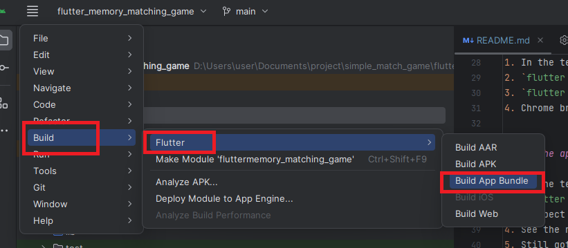

---------
Versions
---------
1. Flutter SDK - 2.5.3 
2. Dart - 2.14.4
3. Gradle - 6.7
4. Java JDK - 15
5. Android Studio - 2023.1.1 Patch 2
6. Kotlin - 1.3.72
7. Groove - 2.5.12
8. Ant - 1.10.8
9. OS - Windows 10 10.0 amd64

--------
Setup
--------
1. Install Android Studio
2. Install Flutter
3. Set windows `PATH` environment, put `D:\tools\flutter\bin`
4. Run `flutter doctor -v`, to ensure everything setup, follow their instruction
5. Install Java 
6. Then, copy the JAVA content `D:\Program Files\Java\jdk-15` to `D:\Program Files\Android\Android Studio\jre`
7. In Android Studio, open project at this path `simple_match_game\flutter_memory_matching_game`

-------
Run the app
-------
1. In the terminal provided by Android Studio
2. `flutter pub get`
3. `flutter run`
4. Chrome browser should open up and the apps should run

------
Build the app
------
1. In the terminal provided by Android Studio
2. `flutter build apk`
3. I expect you to fail at this step, as you need to provide signing file path.
4. See the next step `Sign the app`
5. Still got error? See `Additional Info` below
6. After build success, build an app bundle.
7. In Android Studio, `build -> flutter -> build app bundle`



------
Sign the app
------
1. I have my .jks file in my User Doc .Key folder, reuse that.
2. You should google this steps, as it will be varying from time to time.
3. In case you're being lazy
4. Create `simple_match_game\flutter_memory_matching_game\android\key.properties`
5. Note: I think `git clean -xdf` will delete this file
6. Or `File->Invalidate caches` will delete this, i dk
7. Put
```xml
storePassword=<password>
keyPassword=<password>
keyAlias=upload
storeFile=<path\\to\\your\\.jks\\file>
```

------
Publish on Google App Store
------
1. Go to https://play.google.com/console/u/0/developers/4612657783725842797/app/4972774206369753094/app-dashboard?timespan=thirtyDays

At left panel


At top right


In case you're wondering why it grayed out. At bottom


At right side


You should know what to do next, upload, and click next.

Then, click here, at the left panel


Click send for review


Wait until review pass


--------
Additional Info
--------
1. Your Java & Kotlin, has to be compatible with Gradle version. Search on google for compatible version.
Or here https://docs.gradle.org/current/userguide/compatibility.html.

2. In case you want to change gradle version, change the `distributionUrl` at 
`simple_match_game\flutter_memory_matching_game\android\gradle\wrapper\gradle-wrapper.properties`. 
Then, change the number at `classpath 'com.android.tools.build:gradle:7.0.0'` under 
`buildscript -> dependencies`, at `simple_match_game\android\build.gradle`. The compatible version
are specified in https://developer.android.com/build/releases/gradle-plugin#kts. You can see more
Google Plugin versions in https://mvnrepository.com/artifact/com.android.tools.build/gradle?repo=google.


Then run `flutter build apk` to let system download 
the specified gradle version.

3. Then, if you want to change Java version, Flutter actually use JAVA specified in 
`D:\Program Files\Android\Android Studio\jre`. You can run `flutter doctor -v` to see details 
(For some reason, when I do this command again, it didnt state Java path that it will search for, 
maybe only appear when Java and Gradle versions are incompatible?).


In case you get error like Java version incompatible, try put the new java into that folder.
Check the java version Flutter is currently using at `D:\Program Files\Android\Android Studio\jre\release`.

4. Then, if you want to change Kotlin version. Change the `ext.kotlin_version` under `buildscript`
at `simple_match_game/android/build.gradle`. Find the compatible version with Gradle at
https://docs.gradle.org/current/userguide/compatibility.html.

5. If you get the following error
```
FAILURE: Build failed with an exception.

* What went wrong:
Execution failed for task ':app:bundleReleaseResources'.
> A failure occurred while executing com.android.build.gradle.internal.res.Aapt2ProcessResourcesRunnable
   > Android resource linking failed
     aapt2.exe E 08-30 01:09:24 24240 11436 LoadedArsc.cpp:94] RES_TABLE_TYPE_TYPE entry offsets overlap actual entry data.
     aapt2.exe E 08-30 01:09:24 24240 11436 ApkAssets.cpp:149] Failed to load resources table in APK 'D:\AppData\Sdk\platforms\android-35\android.jar'.
     error: failed to load include path D:\AppData\Sdk\platforms\android-35\android.jar.
```
Try change `compileSdkVersion` to a lower one under `android` at `simple_match_game/android/build.gradle`.

6. By running `.\android\gradlew --version`, it will auto download & install gradle version specified, 
it will be put at `C:\Users\User\.gradle\wrapper\dists\`. You can safely delete this `C:\Users\User\.gradle`
folder, rerun `flutter build apk` will regenerate it. And this `.\android\gradlew` files, will be 
created when you run `flutter build apk`.

7. Change Target API version `minimumSdkVersion` & `maximum SdkVersion` & `compileSdkVersion` at 
`simple_match_game\flutter_memory_matching_game\android\app\build.gradle`.

8. Change app version `flutterVersionName and flutterVersionCode` at 
`simple_match_game\flutter_memory_matching_game\android\app\build.gradle`. And also change `version`, 
by changing the number after `+`, at `simple_match_game\flutter_memory_matching_game\pubspec.yaml`. 
Eg: `1.0.0+1` to `1.0.0+2`.


